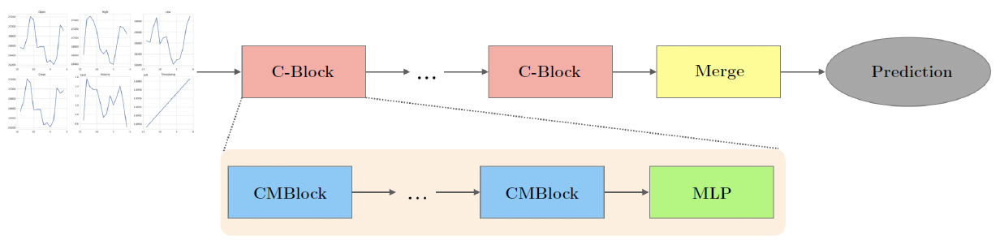
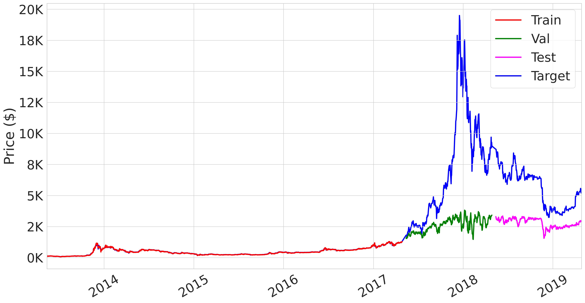
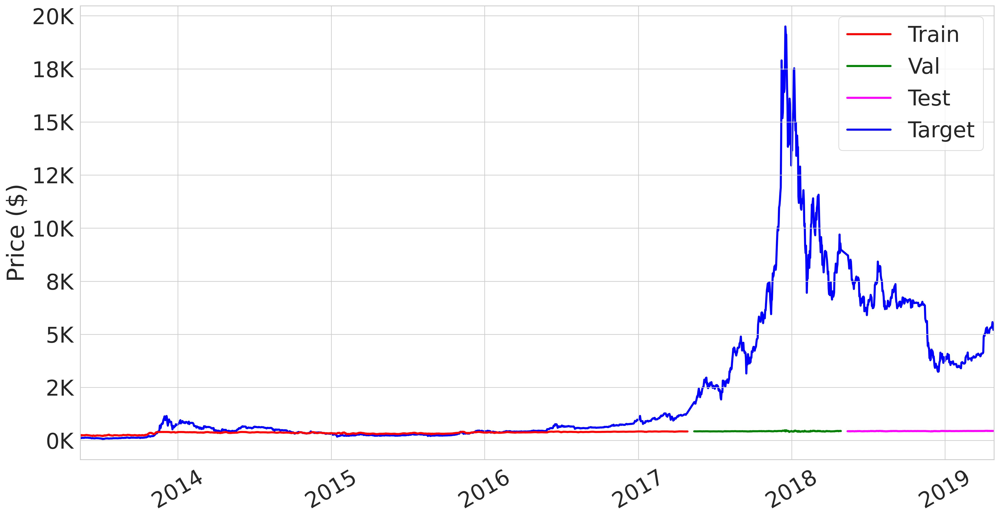
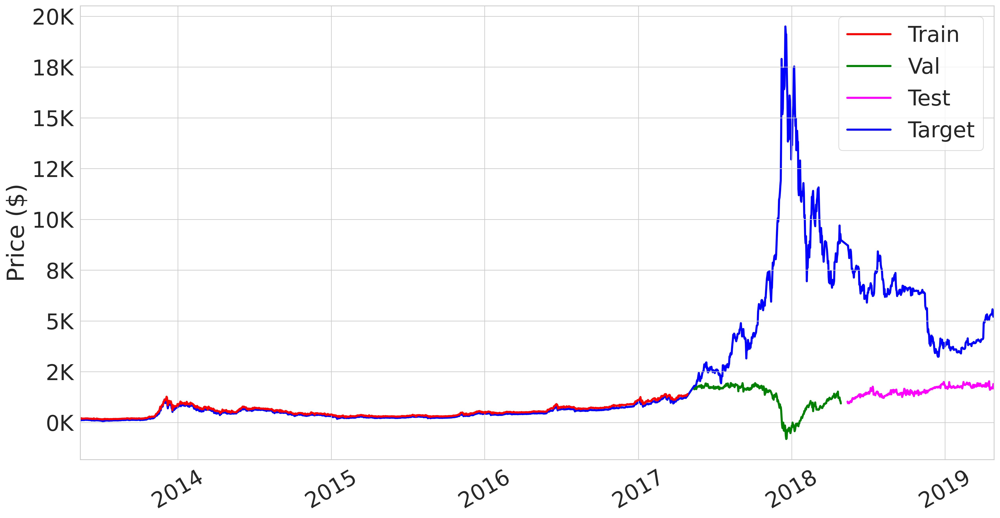
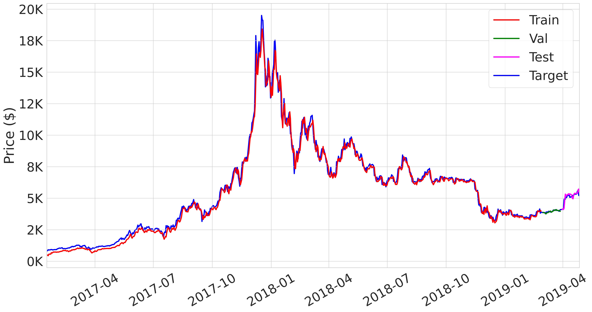
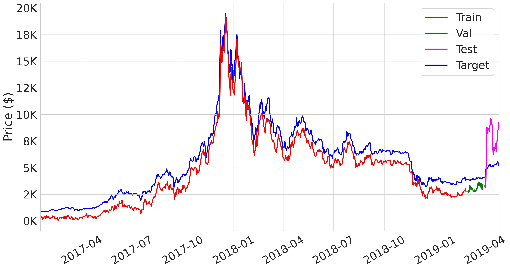
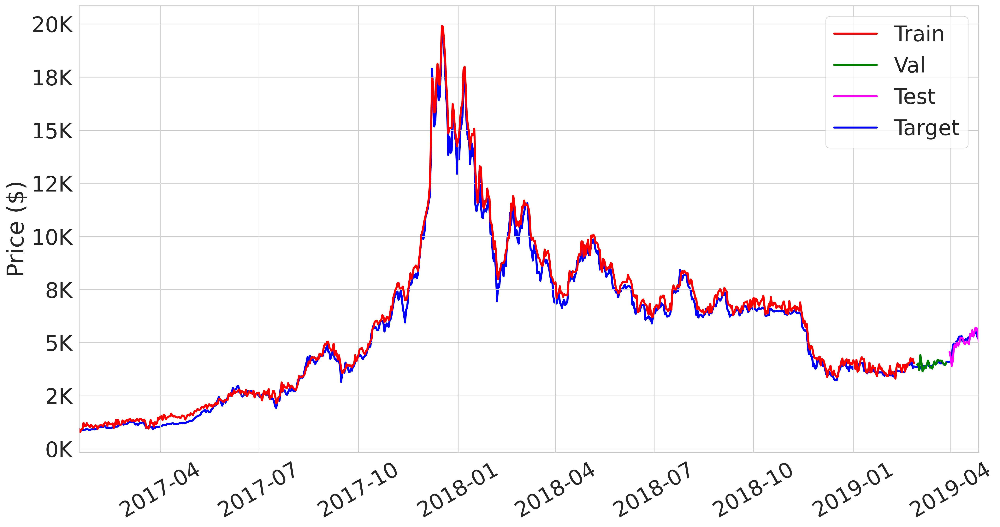
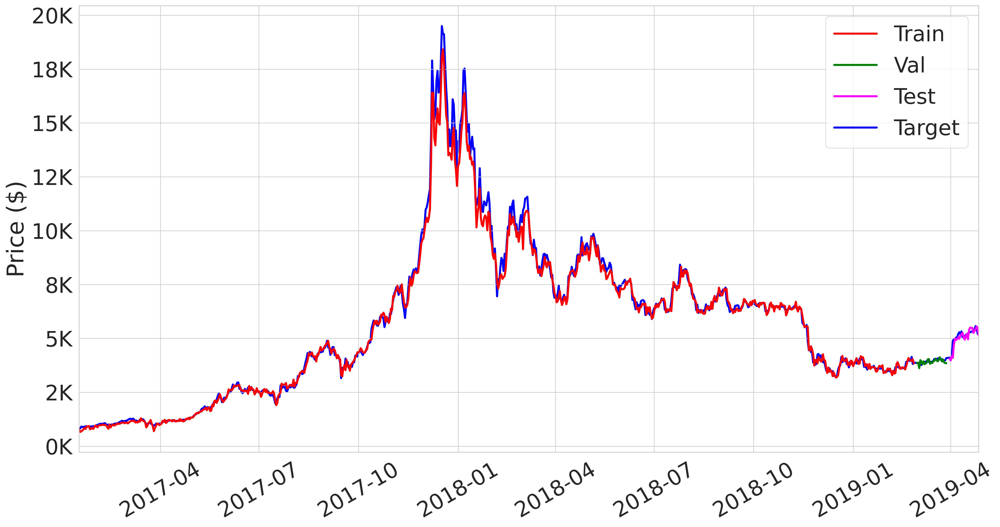
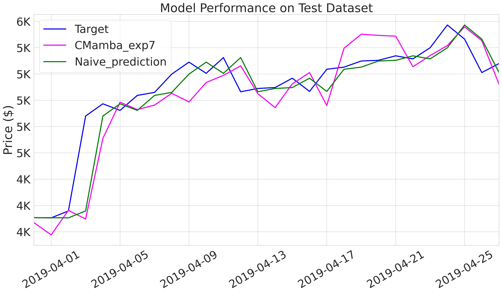

# DATA586 Project

- [DATA586 Project](#data586-project)
  - [Introduction \& Background](#introduction--background)
  - [Dataset](#dataset)
    - [Original dataset](#original-dataset)
    - [Our dataset:](#our-dataset)
  - [Model Architecture](#model-architecture)
  - [Training Environment](#training-environment)
  - [Experiments](#experiments)
    - [1. Reproduce Original Results](#1-reproduce-original-results)
    - [2. Train with Our Dataset](#2-train-with-our-dataset)
      - [Strategy 1](#strategy-1)
        - [Experiement 1](#experiement-1)
        - [Experiment 2](#experiment-2)
        - [Experiment 3](#experiment-3)
      - [Strategy 2](#strategy-2)
        - [Experiment 4](#experiment-4)
        - [Experiment 5](#experiment-5)
        - [Experiment 6](#experiment-6)
        - [Experiment 7](#experiment-7)
    - [Compare with Naive Method](#compare-with-naive-method)
  - [Conclusion](#conclusion)


## Introduction & Background

Predicting Bitcoin prices is extremely challenging due to the cryptocurrency market’s high volatility, non-stationarity, and 24/7 operation. Traditional time-series models like ARIMA and GARCH, as well as deep learning models such as LSTM and GRU, struggle to capture the complex long-range dependencies present in Bitcoin price movements.

CryptoMamba, proposed by Sepehri et al. (2025), introduces a lightweight deep learning architecture based on State Space Models (SSMs) with Mamba blocks, efficiently modeling long-term temporal patterns with just 136k parameters. It demonstrated strong performance on Bitcoin data from 2018–2024, outperforming LSTM, Bi-LSTM, GRU, and S-Mamba models across RMSE, MAE, and MAPE metrics.

In this project, we **first reproduced** the original CryptoMamba results using the same Yahoo Finance dataset (2018–2024) employed in the paper. We then **extended the evaluation** by applying CryptoMamba to an earlier Bitcoin dataset collected from Kaggle (2013–2019) to test the model’s generalization capability under noisier and less mature market conditions.

 The original CryptoMamba implementation is available on
 [GitHub](https://github.com/MShahabSepehri/CryptoMamba/tree/main)
 
```
@article{Sepehri2025CryptoMamba,
      title={CryptoMamba: Leveraging State Space Models for Accurate Bitcoin Price Prediction}, 
      author={Mohammad Shahab Sepehri and Asal Mehradfar and Mahdi Soltanolkotabi and Salman Avestimehr},
      year={2025},
      url={https://arxiv.org/abs/2501.01010}
}
```

## Dataset

### Original dataset
The original dataset contains 4 years (1461) BitCoin data from `2018-09-17` to `2022-09-17` as training dataset. 1 year (365) data from `2022-09-17` to `2023-09-17` as validation dataset and 1 year data from `2023-09-17` to `2024-09-17` as test dataset. 

There are 5 features: 
`Open` : Opening price on the given day
`High` : Highest price on the given day
`Low` : Lowest price on the given day
`Close` : Closing price on the given day
`Volume` : Volume of transactions on the given day

### Our dataset:
We found a older dataset from [Kaggle](https://www.kaggle.com/datasets/sudalairajkumar/cryptocurrencypricehistory/data) from `2013-04-29` to `2019-04-28`. 

## Model Architecture

The CryptoMamba model consists of three major components: **Embedding**, **C-Blocks**, and **Prediction**.

- **Embedding Layer**:  
  Maps raw input features (Open, High, Low, Close, Volume, Timestamp) into a dense representation that the model can learn from.

- **C-Blocks**:  
  Each C-Block contains two **Mamba Blocks** (CMBlocks) followed by a **Multi-Layer Perceptron (MLP)**. The Mamba Blocks apply selective State Space Modeling (SSM) to efficiently capture long-range dependencies across time steps. Stacking multiple C-Blocks enables CryptoMamba to model deep temporal patterns while maintaining a lightweight architecture (~136k parameters).

- **Prediction Layer**:  
  Aggregates the learned representations and outputs the predicted next-day closing price.

An image below illustrates the overall CryptoMamba model pipeline (adapted from Sepehri et al., 2025).



## Training Environment
Google Colab with T4 GPU.

## Experiments

NB: To view our training results on TensorBoard
```bash
tensorboard --logdir ./logs/
```

### 1. Reproduce Original Results

We followed the instructions to use their pre-trained weights to run inference from the original repo. With original dataset, we are able to reproduce the results, please see running [script](reproduce_evaluation.ipynb).

| Dataset | MSE | RMSE | MAPE | MAE |
| --- | --- | --- | --- | --- |
| Train | 1390605.625 | 1179.239 | 0.02969 | 682.193 |
| Val | 359023.312 | 599.186 | 0.01686 | 398.647 |
| Test | 2553899.5 | 1598.092 | 0.02034 | 1120.66 |


### 2. Train with Our Dataset

#### Strategy 1

At initial training, we follow the same structure as they proposed in the papar. We split our data with a **4-year training dataset** (from 2013-04-29 to 2017-04-28), a **1-year validation dataset** (from 2017-04-29 to 2018-04-28), and a **1-year test dataset** (from 2018-04-29 to 2019-04-28).

##### Experiement 1

**Hyperparameter setting (default)**

1. learning_rate: 0.01
2. normalization: False
3. window_size: 14
4. batch_size: 32

| Dataset | MSE | RMSE | MAPE | MAE |
| --- | --- | --- | --- | --- |
| Train | 569.397 | 23.862 | 0.03672 | 15.609 |
| Val | 35378124.0 | 5947.951 | 0.5126 | 4464.943 |
| Test | 9052551.0 | 3008.746 | 0.47199 | 2753.768 |



##### Experiment 2

As the first training didn't capture the validation and test trend, we adjust `batch_size` to 512. 

**Hyperparameter setting**

1. learning_rate: 0.01
2. normalization: False
3. window_size: 14
4. batch_size: **512**

| Dataset | MSE | RMSE | MAPE | MAE |
| --- | --- | --- | --- | --- |
| Train | 67435.078 | 259.683 | 0.40233 | 182.897 |
| Val | 62429332.0 | 7901.223 | 0.90999 | 6645.025 |
| Test | 28370898.0 | 5326.434 | 0.91381 | 5107.485 |



##### Experiment 3

To furthure improve the preformance, we turned on `normalization`.

1. learning_rate: 0.01
2. normalization: **True**
3. window_size: 14
4. batch_size: **512**

| Dataset | MSE | RMSE | MAPE | MAE |
| --- | --- | --- | --- | --- |
| Train | 8373.418 | 91.506 | 0.24683 | 86.914 |
| Val | 58893792.0 | 7674.229 | 0.68339 | 5872.741 |
| Test | 18711456.0 | 4325.674 | 0.68217 | 3974.228 |




#### Strategy 2

Based on the results from Stage 1, we observed that while the model performed well on the training dataset (red line), it consistently underestimated during both the validation and test phases. After analysis, we believe this issue stems from how the dataset was originally split. Given the unique characteristics of time series data—particularly the high volatility and unpredictability of the cryptocurrency market—a large gap between training and test periods can hinder model performance.

Therefore, in Stage 2, we restructured our dataset. We discarded the early-stage cryptocurrency data when the market was less active and trading volume was low. Instead, we focused on a more stable and relevant period, keeping data from 2017-04-28 to 2019-04-28. Additionally, rather than using a full year for both validation and test sets, we used only one month for each. The revised dataset is structured as follows:

- Train: 2017-01-01 to 2019-02-27
- Validation: 2019-02-27 to 2019-03-29
- Test: 2019-03-30 to 2019-04-28

##### Experiment 4

**Hyperparameter setting**

1. learning_rate: 0.01
2. normalization: False
3. window_size: 14
4. batch_size: 32

| Dataset | MSE | RMSE | MAPE | MAE |
| --- | --- | --- | --- | --- |
| Train | 153883.188 | 392.279 | 0.0718 | 267.605 |
| Val | 2878.967 | 53.656 | 0.0104 | 41.216 |
| Test | 48490.383 | 220.205 | 0.03085 | 156.943 |




##### Experiment 5

**Hyperparameter setting**

1. learning_rate: 0.01
2. normalization: False
3. window_size: 14
4. batch_size: **512**

| Dataset | MSE | RMSE | MAPE | MAE |
| --- | --- | --- | --- | --- |
| Train | 1158562.375 | 1076.365 | 0.28308 | 1013.567 |
| Val | 810242.0 | 900.134 | 0.21933 | 865.471 |
| Test | 8346505.5 | 2889.032 | 0.51283 | 2633.195 |





##### Experiment 6

**Hyperparameter setting**

1. learning_rate: 0.01
2. normalization: True
3. window_size: 14
4. batch_size: **512**

| Dataset | MSE | RMSE | MAPE | MAE |
| --- | --- | --- | --- | --- |
| Train | 141498.969 | 376.163 | 0.06874 | 286.286 |
| Val | 26991.277 | 164.29 | 0.0298 | 116.513 |
| Test | 60817.699 | 246.612 | 0.03895 | 192.802 |




##### Experiment 7

**Hyperparameter setting**

1. learning_rate: 0.01
2. normalization: True
3. window_size: 14
4. batch_size: **32**

| Dataset | MSE | RMSE | MAPE | MAE |
| --- | --- | --- | --- | --- |
| Train | 132020.234 | 363.346 | 0.03762 | 217.453 |
| Val | 11221.482 | 105.931 | 0.02195 | 86.696 |
| Test | 45291.039 | 212.817 | 0.03114 | 158.782 |




### Compare with Naive Method

The naive method uses the previous day’s closing price as today’s closing price. To evaluate the model performance, we later compared our based model with naive method results.

| Dataset | MSE | RMSE | MAPE | MAE |
| --- | --- | --- | --- | --- |
| Best model | 45291.039 | 212.817 | 0.03114 | 158.782 |
| Naive | 29699.06 | 172.334 | 2.05396 | 104.894 |




## Conclusion

In this project, we explored [CryptoMamba: Leveraging State Space Models for Accurate Bitcoin Price Prediction](https://github.com/MShahabSepehri/CryptoMamba/tree/main). We first reproduced the results using the original dataset, then applied the model to our own dataset.

During experimentation, we tested different batch sizes, the impact of normalization, and various data splitting strategies. Our results showed that increasing the batch size didn't improve model convergence or performance. However, enabling normalization has improved the model performance on both strategies. Similarly, training the model on a more recent and relevant time period (using just one month for validation and test) — rather than having a large temporal gap between training and test periods (as in the original paper, which used one year) — resulted in noticeably better performance.

To further assess the model’s practicality, we compared our best-performing model against a naive method that simply used the previous day’s closing price as today’s prediction. Surprisingly, the model performed worse than this naive approach. This may be due to several factors. First, cryptocurrency price prediction likely requires more features for accurate forecasting. Our dataset includes only five features, which may limit the model’s ability to learn underlying patterns. Second, in practice, predicting the exact closing price is inherently challenging. An alternative evaluation approach — such as forecasting whether the closing price will increase or decrease by a certain threshold (e.g., 2%) — may be more actionable and still valuable for end users.