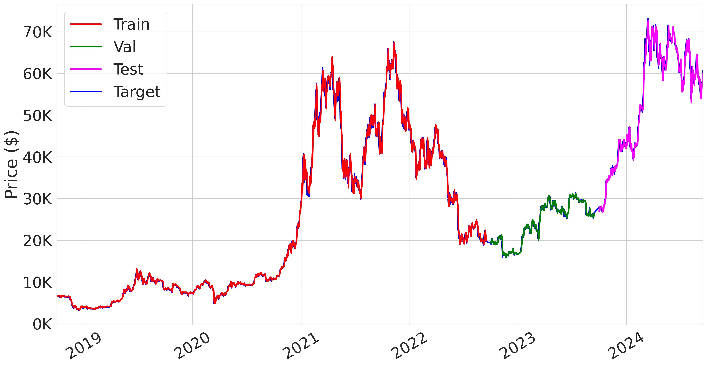
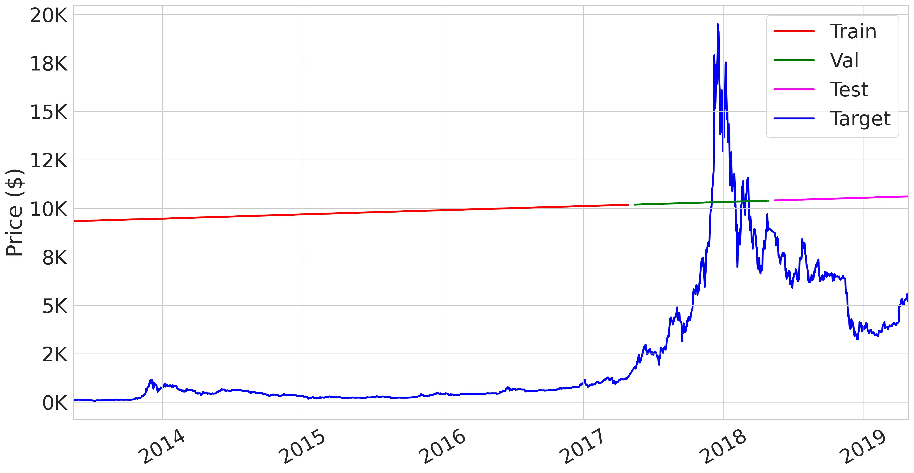

# DATA586 Project

- [DATA586 Project](#data586-project)
  - [Introduction \& Background](#introduction--background)
  - [Dataset](#dataset)
    - [Original dataset](#original-dataset)
    - [Our dataset:](#our-dataset)
  - [Model Architecture](#model-architecture)
  - [Training Environment](#training-environment)
  - [Experiments](#experiments)
    - [1. Reproduce Original Results](#1-reproduce-original-results)
    - [2. Train with Our Dataset](#2-train-with-our-dataset)
      - [Strategy 1](#strategy-1)
        - [Experiement 1](#experiement-1)
        - [Experiment 2](#experiment-2)
        - [Experiment 3](#experiment-3)
      - [Strategy 2](#strategy-2)
        - [Experiment 5](#experiment-5)
        - [Experiment 6](#experiment-6)
    - [Compare with Naive Method](#compare-with-naive-method)
  - [Conclusion](#conclusion)


## Introduction & Background

<mark>@Luna Please~ Add something here.</mark>

[GitHub](https://github.com/MShahabSepehri/CryptoMamba/tree/main)
```
@article{Sepehri2025CryptoMamba,
      title={CryptoMamba: Leveraging State Space Models for Accurate Bitcoin Price Prediction}, 
      author={Mohammad Shahab Sepehri and Asal Mehradfar and Mahdi Soltanolkotabi and Salman Avestimehr},
      year={2025},
      url={https://arxiv.org/abs/2501.01010}
}
```

## Dataset

### Original dataset
The original dataset contains 4 years (1461) BitCoin data from `2018-09-17` to `2022-09-17` as training dataset. 1 year (365) data from `2022-09-17` to `2023-09-17` as validation dataset and 1 year data from `2023-09-17` to `2024-09-17` as test dataset. 

There are 5 features: 
`Open` : Opening price on the given day
`High` : Highest price on the given day
`Low` : Lowest price on the given day
`Close` : Closing price on the given day
`Volume` : Volume of transactions on the given day

### Our dataset:
We found a older dataset from [Kaggle](https://www.kaggle.com/datasets/sudalairajkumar/cryptocurrencypricehistory/data) from `2013-04-29` to `2019-04-28`. 

## Model Architecture
#TODO ...

## Training Environment
Google Colab with T4 GPU.

## Experiments

### 1. Reproduce Original Results

We followed the instructions to use their pre-trained weights to run inference from the original repo. With original dataset, we are able to reproduce the results, please see running [script](reproduce_evaluation.ipynb).

| Dataset | MSE | RMSE | MAPE | MAE |
| --- | --- | --- | --- | --- |
| Train | 1390605.625 | 1179.239 | 0.02969 | 682.193 |
| Val | 359023.312 | 599.186 | 0.01686 | 398.647 |
| Test | 2553899.5 | 1598.092 | 0.02034 | 1120.66 |



### 2. Train with Our Dataset

#### Strategy 1

At initial training, we follow the same structure as they proposed in the papar. We split our data with a **4-year training dataset** (from 2013-04-29 to 2017-04-28), a **1-year validation dataset** (from 2017-04-29 to 2018-04-28), and a **1-year test dataset** (from 2018-04-29 to 2019-04-28).

##### Experiement 1

**Hyperparameter setting (default)**

1. learning_rate: 0.01
2. normalization: False
3. window_size: 14
4. batch_size: 32



##### Experiment 2

As the first training didn't converage, we adjust `batch_size` to 512. 

**Hyperparameter setting**

1. learning_rate: 0.01
2. normalization: False
3. window_size: 14
4. batch_size: **512**

##### Experiment 3

To furthure improve the preformance, we turned on `normalization`.

1. learning_rate: 0.01
2. normalization: **True**
3. window_size: 14
4. batch_size: **512**


#### Strategy 2

Based on the results from Stage 1, we observed that while the model performed well on the training dataset (red line), it consistently underestimated during both the validation and test phases. After analysis, we believe this issue stems from how the dataset was originally split. Given the unique characteristics of time series data—particularly the high volatility and unpredictability of the cryptocurrency market—a large gap between training and test periods can hinder model performance.

Therefore, in Stage 2, we restructured our dataset. We discarded the early-stage cryptocurrency data when the market was less active and trading volume was low. Instead, we focused on a more stable and relevant period, keeping data from 2017-04-28 to 2019-04-28. Additionally, rather than using a full year for both validation and test sets, we used only one month for each. The revised dataset is structured as follows:

- Train: 2017-04-28 to 2019-02-28
- Validation: 2019-03-01 to 2019-03-28
- Test: 2019-03-29 to 2019-04-29

##### Experiment 5

**Hyperparameter setting**

1. learning_rate: 0.01
2. normalization: True
3. window_size: 14
4. batch_size: 512

##### Experiment 6

**Hyperparameter setting**

1. learning_rate: 0.01
2. normalization: True
3. window_size: **7**
4. batch_size: 512

### Compare with Naive Method
#TDOO


## Conclusion
#TODO